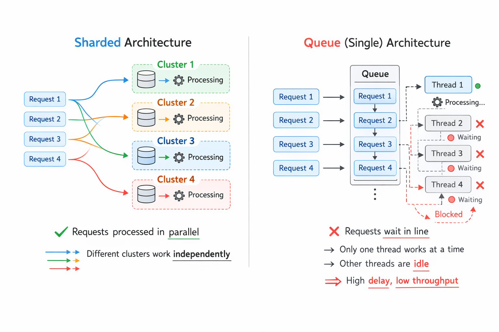
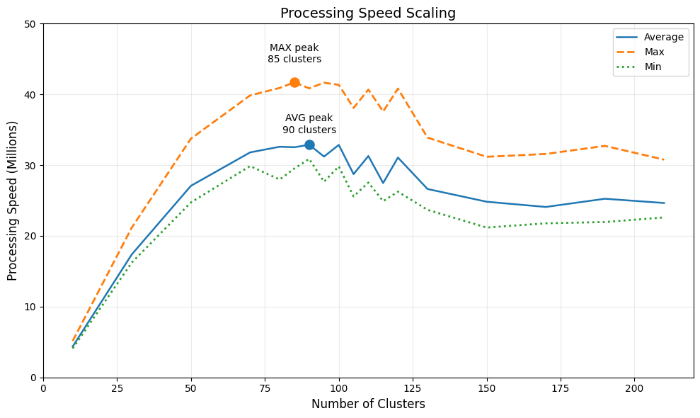

# Fast multithreaded cache
<p align="justify">
This project implements a high-performance multithreaded in-memory cache
designed to handle extremely large datasets with minimal contention.
</p>

---

###  Features

- Supports both synchronous and asynchronous requests
- Does not guarantee strong consistency (optimized for performance)
- Moreover, it is well optimized to handle a huge number of requests simultaneously
- All data is stored in RAM
- Configurable number of clusters

---

### Technology Stack

- C++ 20+

---

### Design Rationale

<p align="justify">
The cache is partitioned into independent clusters.
Each cluster manages its own synchronization primitive,
which significantly reduces contention compared to a single global lock.

This design allows near-linear scaling until memory bandwidth
or context switching overhead becomes the limiting factor.
</p>



---

### Complexity

- Average access time: O(1)  
- Insertion: O(1)  
- Removal: O(1)

Scalability limited primarily by memory bandwidth and scheduling overhead. But in fact hash-function of a key plays a huge role.

---

### Project Architecture
<p align="justify">
Folder just contains the header file of the cache class <code>cache.h</code> and an additional folder for testing <code>tests</code>:
</p>

- Self-written tool for testing `test_tool.h`
- A couple of tests for check correct work of cache `test.cpp`
- File with test on huge random request number `heavy_stress_test.cpp`

---
### Examples

#### Quick start

```C++
#include "cache.h"

int main() {
    
    Cache <int, int> cache(n); // where n is a number of threads and clasters
    
    return 0;
}
```

#### Simple requests

```C++
    cache.set_async(key, data);
```
```C++
    cache.remove_async(key);
```
```C++
    auto data = c.get_sync(key);
```

---

### Performance

<p align="justify">
Based on 30 independent stress test runs from <code>heavy_stress_test.cpp</code>,
the following performance metrics were obtained:
</p>

| Number of clasters | Max processing speed (Millions per second) | Min processing speed (Millions per second) | Average processing speed (Millions per second) |
|--------------------|--------------------------------------------|-----------------------|---------------------------|
| 10                 | 5.15M                                      | 4.10М                 | 4.36М                     |
| 30                 | 21.18М                                     | 16.24М                | 17.39М                    |
| 50                 | 33.75М                                     | 24.73М                | 27.08М                    |
| 70                 | 39.85М                                     | 29.87М                | 31.80М                    |
| 80                 | 40.91М                                     | 27.97М                | 32.60М                    |
| 85                 | 41.71М                                     | 29.53М                | 32.53М                    |
| 90                 | 40.85М                                     | 30.88М                | 32.88М                    |
| 95                 | 41.65М                                     | 27.66М                | 31.21М                    |
| 100                | 41.35М                                     | 29.82М                | 32.86М                    |
| 105                | 38.08М                                     | 25.58М                | 28.73М                    |
| 110                | 40.68М                                     | 27.54М                | 31.29М                    |
| 115                | 37.58М                                     | 24.91М                | 27.47М                    |
| 120                | 40.82М                                     | 26.25М                | 31.07М                    |
| 130                | 33.89М                                     | 23.68М                | 26.63М                    |
| 150                | 31.18М                                     | 21.18М                | 24.83М                    |
| 170                | 31.58М                                     | 21.78М                | 24.09М                    |
| 190                | 32.72М                                     | 21.96М                | 25.25М                    |
| 210                | 30.78М                                     | 22.61М                | 24.65М                    |

<p align="justify">
On this data I have created a plot of the relation between a number of clusters and processing speed of cache:
</p>



<p align="justify">
From the plot we observe that the highest possible performance come out if th number of clusters is in range between 70 and 100 pieces, but if consider also average peak and minimum pick, you can conclude that the best number of clusters is in range between 85 and 90 pieces. So I recommend using 80 or 85 clusters if you use this cache, these values also align with the commonly used heuristic: <code>clusters = 4 * threads</code>.
</p>

---

### Scalability Analysis

After ~100 clusters performance degradation is observed.
This is likely caused by:

- Increased scheduling overhead
- Higher cache-line invalidation frequency
- Memory bandwidth saturation
- Diminishing returns from oversubscription

Thus, cluster count should not significantly exceed `4 * the number of worker threads`.

---

### Benchmark Environment

- CPU: 13th Gen Intel i9-13900H
- Cores: 14 (20 threads)
- RAM: 16GB
- Compiler: g++ 13
- OS: Windows 11
